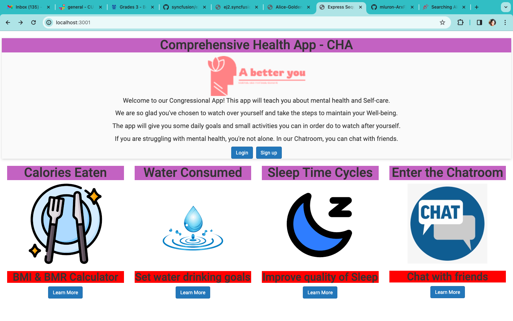

# Comprehensive-health-app
## Congression App Challenge 2023

Welcome to our Congressional App! This app will teach you about mental health and Self-care.We are so glad you've chosen to watch over yourself and take the steps to maintain your Well-being.

The app will give you some daily goals and small activities you can in order do to watch after yourself. If you are struggling with mental health, you're not alone. In our Chatroom, you can chat with friends.

## Video demo of the Health Tracker App
Please see the link to the app's video demonstration here:
Please listen to our podcast here:

## Description of the Health Tracker App
Please briefly describe what your app does?

## Background information
What inspired you to create this app?

We believe that in order to be successful in monitoring your health, you can use our health tracker application!

## Technical challenges
What technical difficulties did you face programming your app?

One difficulty that we encountered while creating our application is the User's dashboard features. 

## Future developement
What improvements would you make if you were to create a 2.0 version of your app? 

If there was a 2.0 version of our app, we would include more features to help the users services. For example we would add 

## Screenshots of the App
Please include cover photos from your app!
-

## Contact me
- [GitHub](https://github.com/mluron-ArxFjs)

- mluron2@gmail.com
